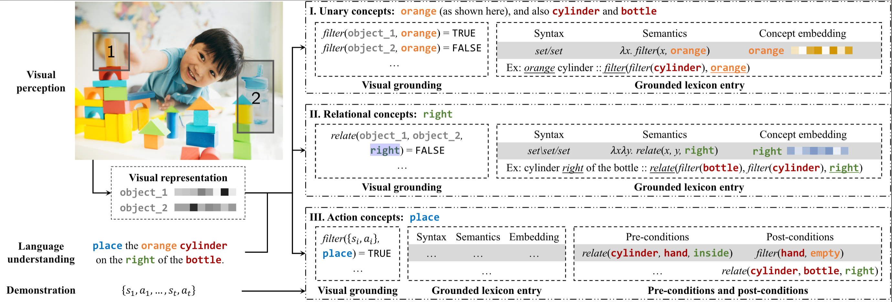

# Concepts

A Concept-Centric Framework for Intelligent Agents.

[[Website]](http://concepts.jiayuanm.com/) [[Tutorials]](http://concepts.jiayuanm.com/tutorials.html)  [[API References]](http://concepts.jiayuanm.com/reference/concepts.html)

This project investigates a framework for building intelligent agents by internalizing a vocabulary of "concepts," which are
discrete symbols that are associated with structured representations.

At the high-level, such structured representations are composed of _multiple components_, for example:

- The syntax type of the concept (e.g. a noun, verb, adjective, etc.)
- For visual concepts, a classifier that can be used to detect the concept in an image.
- For relational concepts in visual domains, a generator for sampling images or object poses that are consistent with the concept.
- For action concepts, a generator for generating a sequence of motor commands that accomplish the underlying goal of the concept.
- For action concepts, a precondition that must be satisfied before the concept can be executed.
- For action concepts, a postcondition (effect model) that describes the effect of executing the concept.
- _etc._

The following figure illustrates the basic idea of different modules.

Such vocabulary would allow us to build agents that can reason about, and make plans in the world in terms of concepts.
More concretely, here are some examples of how this framework could be used:

- parse natural language sentences into programmatic representations of their meaning.
- perform visual reasoning, e.g. "find the object that is red and is on the left of the blue object."
- accomplish goals specified in natural language, e.g. "find the red object and put it on the blue object."
- _etc._

The second important component of this framework is that different components of the concepts can have
programmatic, _neuro-symbolic_ representations. For example, the semantic meaning of the word "red" can be represented
a program ``lambda x: filter(x, color='red')`` that filters a set of objects by their color. The actual implementation of
the program modules (e.g. the ``filter`` function) can be a neural network. Meanwhile, the representation for the color
concept here ``red`` can be represented as a vector in a semantic space. Similarly, for example, for action concepts,
their preconditions and postconditions can be represented as modular neural networks.

Some key papers underlying this framework are:

1. [PDSketch: Integrated Domain Programming, Learning, and Planning](https://openreview.net/forum?id=BuQIv5Qe35)
    
    Jiayuan Mao, Tomás Lozano-Pérez, Joshua B. Tenenbaum, Leslie Pack Kaelbling.
    NeurIPS 2022.

2. [Grammar-Based Grounded Lexicon Learning](https://arxiv.org/abs/2202.08806)
   
    Jiayuan Mao, Haoyue Shi, Jiajun Wu, Roger P. Levy, Joshua B. Tenenbaum. NeurIPS 2021.

3. [The Neuro-Symbolic Concept Learner: Interpreting Scenes, Words, and Sentences From Natural Supervision](https://arxiv.org/abs/1904.12584)

    Jiayuan Mao, Chuang Gan, Pushmeet Kohli, Joshua B. Tenenbaum, Jiajun Wu. ICLR 2019.

4. [Neural Logic Machines](https://arxiv.org/abs/1904.11694)

    Honghua Dong*, Jiayuan Mao*, Tian Lin, Chong Wang, Lihong Li, Dengyong Zhou. ICLR 2019.

## Structures

The structure of this project is as follows:

- The [concepts.dsl](http://concepts.jiayuanm.com/reference/concepts.dsl.html) module contains core data structures for domain-specific languages (DSLs) that will be used to represent concepts.
- The [concepts.language](http://concepts.jiayuanm.com/reference/concepts.language.html) module contains core data structures (syntax and semantic forms) for representing and parsing natural language sentences.
- The [concepts.pdsketch](http://concepts.jiayuanm.com/reference/concepts.pdsketch.html) module contains core data structures for representing and planning with action concepts.

For tutorials, see the [tutorials](http://concepts.jiayuanm.com/tutorials.html) section.